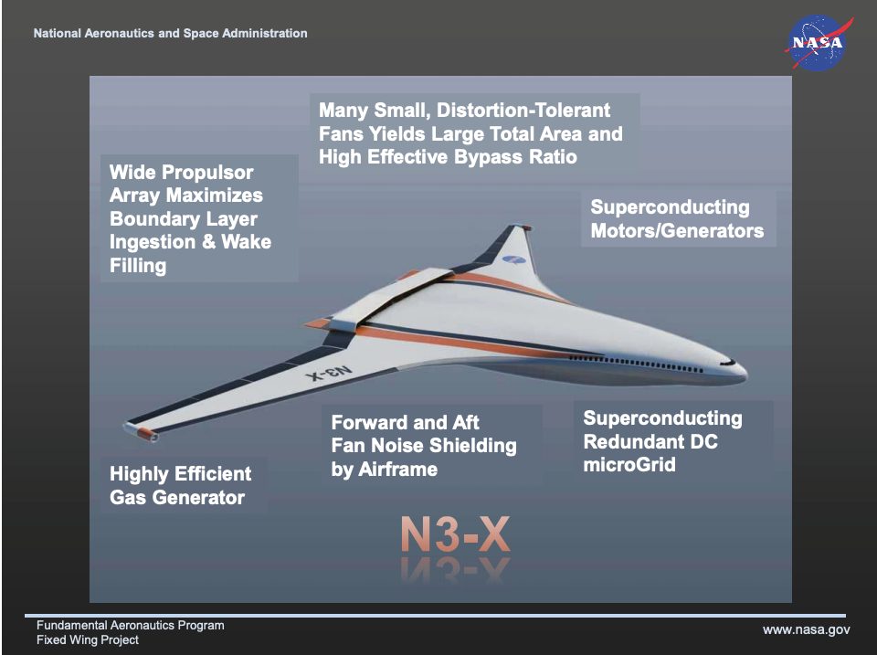
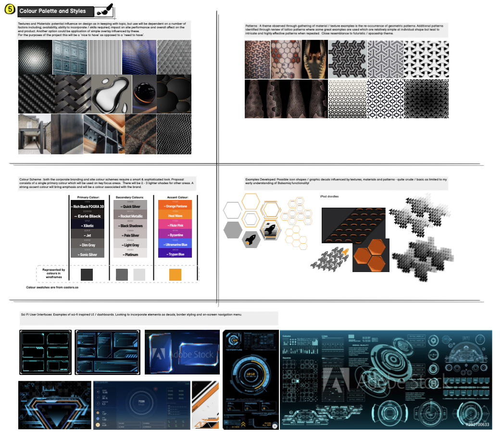
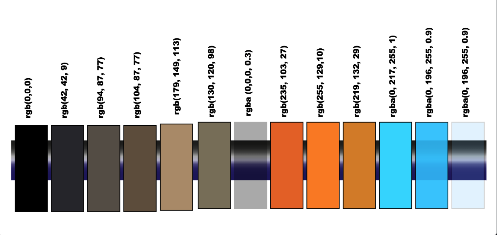
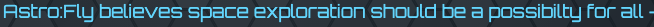
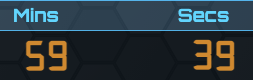
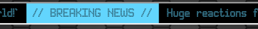
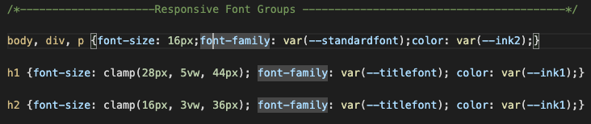

# Astro:Fly - Milestone Project 1

## Links to;

[Astro:Fly - Live Site](https://kelvenh.github.io/Astro-Fly_Milestone_1/index.html)

[GitHub Repo](https://github.com/KelvenH/Astro-Fly_Milestone_1/)

[Wireframes - v.Balsamiq](README-docs/Wireframe-Astrofly-Full-v.Balsamiq.bmpr)

[Wireframes - v.PDF](README-docs/Wireframe-Astrofly-Full.pdf)

***

## Contents

1. [Overview](#Overview)
2. [UX;](#UX)

   [- User Stories](#User-Stories)
   
   [- Personal Goals](#Personal-Goals)
   
   [- Scope](#Scope)
   
   [- Structure](#Structure)
   
   [- Skeleton](#Skeleton)
   
   [- Surface](#Surface)
   
3. [Content & Design Features](#Content-and-Design-Features)
4. [Styles](#Styles)
5. [Images](#Images)
6. [Technologies Used](#Technologies-Used)
7. [Testing](#Testing)
8. [Bugs and Defects](#Bugs-and-Defects)
9. [Deployment](#Deployment)
10. [Acknowledgements](#Acknowledgements)

---
## Overview
Astro:Fly is a fictional company offering space tourism / commercial flights. In this scenario, the service has recently launched some routes with additional offerings to come and a web site is being launched to garner public interest, provide information and register details of potential clientele. This project has been undertaken for educational purposes to demonstrate HTML and CSS essential skills (Code Institute Milestone Project 1). Any referrences to technologies are purely fictional and are not based on scientific fact.  

---

## UX

### User Stories 
(Fictional Scenarios)

#### Business Requirements 
Astro:Fly require a site which;
- generates buzz and excitement to the general public and media
- conveys image of a safe and ethical brand (despite the slight irony the service could have on planet earth / airspace)
- provides prospective clients with summary of planned voyages tus leading to the registration of potential clientele

#### Client Goals 
Site visitors are expected to fall into 1 of 3 categories;
- media; the new service is expected to create attention due to this being an extreme niche service / limited rivals
- general public; seeking latest information on the planned service such as timelines, what services will be offered and images 
- prospective clients, who are; 
      - able to find information about the services provided
      - clear and easy navigation through the site
      - easy registration of personal details for more information / booking.  

### Personal Goals 
(Actual)
Through this project I am looking to; 
- Demonstrate understanding and application of HTML and CSS essential skills.
- Broaden personal awareness of further capabilities of HTML and CSS which go beyond those covered in module 1.
- Experience challenges, bugs, errors and frustrations through which problem solving will be a huge value-add / personal learn.
- Understand the limit of my current capabilities - looking to stretch myself without trying to achieve the impossible for a coding noob! 
- Serve as an example for a future portfolio of web site design and development which will also be used as an entry point which future projects can be assessed against to demonstrate improvements.
- The subject chosen for this project is to be fun, engaging but also on an area where broad range of dramatic / exaggerated design elements can be employed and have relevance - as opposed to a more traditional retail site where these would be out of place (e.g. use of transitional effects, fonts, color palette).
- Be proud of the final output!

### Scope 
(what's on the table for inclusion?)
  - landing / home page - welcome, intro and enticement to remain on site
  - detail of services - what, where, how?
  - gallery - images
  - client registration (modal form)
  
### Structure
(how is information structured and logically grouped?)
  - consistent theme across sites
  - header / navigation menu and footer mirrored across all pages
  - central / main content to remain same theme / branding but adapted to suit requirements of that page and be interesting / exciting to the users.
  - content over minimu of 3 pages to include Home, Sales and Gallery

### Skeleton 
(how information will be presented / navigated)
 - all pages must be responsive 
 - navigation will primarily be through the menu (to appear as drop down on small screen devices and potentially permanent sidebar for larger screens)
 - additional links added to act as shortcuts 
 - outine available in Balsamiq - example shown below
 
 
 
 

### Surface
(what will the finished product look like; color palette, fonts, images and other design elements)
  - initial outline developed in Balsamiq with extracts shown above)
  - mock-up of final rendering (screen grabs)

---
## Content and Key Design Features

Page | Features | In Build | Comments |
-----|----------|----------|----------|
General | Navigation menu and footer to social media links| Yes | 
Home | Intro, Countdown timer to next launch, news ticker | Yes | Majority of features included although some 'workarounds' e.g. countdown timer only counts down for a speciic time and resets on page load.
Flights|Oerview of the services provided with embedded images| Yes | Scaled back initial plans due to overall volume and some design elements which would have relied upon JS|
Sign-Up|Modal Form to register for details| Yes | in addiiton to sale enquiries page was also used to highlight and register for membership|
Gallery |animated scroll through of images|No - animation requires JS|Opted to embed images within Flights page|
404 Error Page|Mock 404 page to be linked to for inactive links in Navigation | No | Page built with auto-forward to index page but removed on advice of mentor not to have redundant links.

Outline of key features delivered;

### HOME PAGE:

- Animated hero banner - animation applied on page load to fade globe image into view and at the same time adjust the color brightness. The rise to over-saturatin before reducing is to simulate the appearance of the sun risisng over the horizon to mark the start of a new day - in keeping with the strapline "A New Dawn in Space Adventure"

- Ticker news bar - used as a means of portraying the ethos of the ficticious company. In addition to prompts for visitors to sign-up / register for seats, news articles include, court case outcome whereby the parent corporate Group no longer has to pay any domestic taxes (or staff) as company now registered on the moon. Subsequent news article (as a cuase of a potential new global financial crisis) used to also show how the Corporation intends to use this for further financial gain through their off-planetary banking and fincial systems. I debated whether to retain this ticker as pro-longed reading (eyes moving right as text scrolls left) can be straining on the eyes. But i made adjustments (text size, scroll speed, font color) to minimise as wanted to retain (this was a huge challenge to develop - referrenced in acknowledgments section).   

- Media feed - mentor suggested the inclusion of a YouTube clip. As no actual company exists i added a link to a recent NASA feed but made a couple of remarks on the page (with text changing to red) to indicate the media feed has been hacked - otherwise would not be appropriate to be showcasing competitors achievements. Also subtle nod to the news ticker story (come back from the US government?!)

-  Launch countdown - another tricky feature to develop. When I discovered animation property i initially thought i could use a series of hide/show numbers over staggered timings to replicate LED time changing. But i was unable to do this in a way that would reveal the digits in the same location or be fully hidden / not impact digits which were being displayed. After reasearching on-line, this seems as though this would normally be accomplised through the use of JavaScript. But as not familiar nor considered through the assessment of milestone1, I located an alternative CSS approach (referrenced in acknowledgments section).  I had to adapt as example counted down from 100 whereas time needs to countdown in tens (e.g. 10 individual seconds to change the 10's digit) and by 6 (i.e. 6 x 10s = 1 minute. To achieve this i effectively created two sub-groups for the animation properties which i assigned to digits or 10's. Note this is not an actual countdown (it resets when page loaded / tab expanded).

- central graphic - sci-fi user interface inspired feature. Please refer to the notes (Styles) regarding SVGs and how these had to be scaled back from original plans.

Flights:

- the main feature here is the static (sticky) foreground image and the scrolling images and text which go under the astronaut. Intention here was to try and portray a personal experience of adventure. Please refer to Bugs and Defects section regarding unresolved challanges which can affect certain screens. If you experience problems viewing this page please re-size the browser and it should work! The main challange here was understanding the relationship and complexities between fixed, relative and absolute positioning.  For the animated text to be displayed on-top of the scrolling image, these had to be positioned absolute. But as this takes them out of the flow of the content, their existence is not acknowledged by the forground image. The only solution able to make this work was to use a negative margin to 'pull' the forground image into place. However, this combined with fixed header (also responsive sizing) do not go together well. The images themselves are sourced online (see acknowledgements). The initial image was 'cut' in Photoshop and filled with a repeating pattern to cover the gap caused by the removal of the astronaught.

- Trips - As this page was being developed i opted to drop the use of a seperate gallery page as felt there was more of a realistic useage if used in relation to the services offered than simply a stand alone gallery wuld achieve. Most images are taken straight from royalty free stock images or Adobe Stock (have license through Creative Cloud account). Particular mentions to;
   (lunar rides) - attention to detail - look closely as you will see some very subtle 'Astro:Fly logos on the spacecraft wing tips and embroided into the seat backs. These are screenshots of the home page logo edited in PhotoShop to apply natural curves, colorings and texture effects for realism.
   (space safari) - the vehicle 'newest addition' was built by me in a 3d modelling program 'Blender'. Unexperienced in this field too - so a short intro course taken to enable me to do the basics. I then took an image of a real NASA concept (NASA N3 X - see image below) although this was demoed as an electric plane - not space-craft. Originally i had planned to make more use of the model within my site but there was not enough time to develop more content.
   
 

- Registration Page - the main purpose of this page was to anchor a modal form. I opted to host this on it's own page as a) only 2 page links on a nav bar didn;t seem sufficient) and b) opportunity to embelish the Astro: story further through the creative tiered memberships which are revealed through the use of linked tabs and panels (based on Bootsrap example). 
- The form itself supports useage for both potential bookings and membership joining and links to a 4th page which was created to replicate a sense of submitting the form actually executing an action - as there is no actual mailbox / database linked. This was intentionally left simple with a navigation button returning to the Home page.
- The hero image is a photoshop collection of 4 images to which the Astro:Fly logo was added (as mentioned above), a rock was filtered to look like a frozen meteorite and reflection of the Earth image was applied to the astronauts visor. 

404 Error Page - original plan was that a couple of further links would be added to give a more realistic list of content for the nav bar but these pages would not actually exist (as not required for this project). Instead they linked to a 404 error page. On mentor's advice these were removed as not felt appropriate to create 'dead links'. But the page itself still exists but can only be seen by navigating to the html page directly - it is not set to appear as a 404 error page is intended as did not have time to develop. This page was also going to link to a news article linking secret purchase of Area51 by the corporation and create suspicion to the technological deveopments. But opted not to include when the 404 page was not shown anyway.

---
## Styles

### Site Theme

Considered | Selected| Notes|
-----------|---------|------|
Cyberpunk | No | Whilst preferred to style selected, expect this would require additional resources, time to incorporate which would detract from primary objectives for the project
Vintage (e.g. 70's prediction of future) | No | For same reasons as given above.
Futuristic | Yes | Expect these to be more easily available and achieved through basic shapes / easily available images |

Extract of Balsamiq design elements - initial considerations;

### Color palette 

Opted for smart, sophisticated visual branding with futuristic styling. Image below displays colors used. These are partially shown against a dark background to indicate transparency levels.

### Fonts and Typography
In keeping with the futuristc theme, the basic text uses font types sourced from GoogleFonts.

Another GooleFont was used for a slight difference appearance where looking to imply digital display

A more dramatic font was sourced for the company logo and H1 headings.
('Ethnocentric' licence purchased for usage via fontspring.com)

Special fonts were used for particular purposes; the digital countdown clock and digital news ticker. 
(Digital & LED fonts available on free license for non-commercial use via dafont.com)

### Responsive Font Groups

Font types, colors and sizes were added to the Root Directory (see style.css for details). Additionaly, i took this one stage further by creating responsive font groupings. Each grouping comprises of a font family, font size, color and in some cases varaition on font weight. 'Clamp' was also applied to the font size to set min / max size and retain better control through responsive resizings. Example shown below. This enabled consistent application across content.
Note, these are shown on single lines (as opposed to standard line by line property) as found this easier to refer to. 

### Images

 Page    | Image - Description                    |                             Filename |                   Source |                               Notes |
---------|----------------------------------------|--------------------------------------|--------------------------|-------------------------------------|
Multiple | hex tiled pattern                      | tiled-hex_black.svg                  | stock.Adobe.com          |                                     |
Home     | Globe (hero img)                       |planet_earth.jpeg                     | stock.Adobe.com          |                                     |
Home     | Satellite & Dish                       |INAL1Dish.svg, INAL1satellitesvg.svg. | stock.Adobe.com          |                                     |
Home     | Globe (hologram)                       |globe-holo-final-reduced.svg          | stock.Adobe.com          |                                     |
Home     | central HUD                            |HUD1Asset-3.svg                       | SVG created in Adobe Illustrator |        (see svg notes below)|
Flights  | Astronaut and initial 'gas cloud'      |flights-hero-frame-6000px.png         | stock.Adobe.comx2,Depositphotos.comx2|                          |    Flights  | Other images (in order)                |star-collage | Depositphotos.com  | merged + blended in Photoshop to create a continuous scroll         |
Flights  | Moon                                   |moon-half.png                         | stock.Adobe.com           |                                     |
Flights  | (Moon) footprint                       |moonprint.jpg                         | stock.Adobe.com           |                                     |
Flights  | (Moon) base                            |moonbase-5.jpg                        | Depositphotos.com         |                                     |
Flights  | (Moon) spacecraft                      |craft1.jpg                            | google images             |                                     |
Flights  | (Moon) ship interior                   |ship-seating.jpg                      | pexels.com                |                                     |
Flights  | Earth                                  |earth-half.png                        | pexels.com                |                                     |
Flights  | (Space Safari) model - 2 images        |Observor.png, spacestation2.jpg       | turbosquid.com            |                                     |
Flights  | (Space Safari)  corridor               |spacestation5.jpg                     | turbosquid.com            |                                     |
Flights  | (Space Safari) spacecraft              |craft-2.jpg                           | self made - Blender       |                                     |
Flights  | (Space Safari) 'probe'                 |probe.jpg                             | turbosquid.com | Photoshopped collection of parts of a building model|
Flights | Mars                                    |mars.png,                             | Depositphotos.com       |                                      | 
Flights | (Mars) Mars camp - 2 images             |Mars-camp2.jpg, mars-settlement.jpg   | Depositphotos.com        |                                      |
Flights | (Mars) rover                            |mars-rover.png                        | Depositphotos.com        |                                      |
Flights | (Mars) local native                     |mars-alien.jpg                        | Depositphotos.com        |                                      |
Registration | hero img                    | cold-astronaught-2500px.png | (Earth), (Astronaut), (rock), (spacecraft) | Photoshopped collection of 4 images| 

### Special note on SVGs - intention was to provide a sci-fi themed User Interface. Inspiration was from combination of Sci-Fi films / tv, PC games and search on Sci Fi / Concept User Interfaces via Pinterest. Specific sites useful for research;
https://sciencefictioninterfaces.tumblr.com/
https://www.saji8k.com/kit-fui/movie/
Initially, time was invested in understanding clip-paths to style the element borders. However, upon imlementing challenges arose due to responsive and dynamic re-sizing of elements resulting in squashed / stretched elements. 
In researching how these could be over-come, I learnt about SVGs and the benefits of these for responsiveness. Time was then spent on constructing some very effective SVGs and whilst these were more flexible, they also suffered due to the dynamic sizing. For example, the content of drop-down tabs differs, which again impacted the display of the SVG (i.e. strecthed / overflow for longer content and empty spacing for shorter content). Thorough research was conducted to try and retain these artefacts. A basic understanding of SVGs properties specifically ViewBox, sizng and 'retainAspectRatio'. 
I then discovered the 'border-image' property. The challenges here was that i wanted to use an axiting 'frame' (SVG) whereas this property seemed to be more appropriate for using images as repeating patterns. Initially i thought the border-slice property would enable me to accomplish the task. But although i could define which parts of the SVG should be used for which part of the border, it still resulted in stretch / collapse of the SVG sides (dynamic content)  and some sideways adjustments for the responsive sizings.
The final route i looked at was to split the SVG into three parts - a top, middle and bottom. Logic here was that as most of the movement was in the height, if i kept the styling to the top and bottom sections changes in the height (which would only be straight sections) would not be compromised - especially when i discovered properties on the individual SVG code can instruct not to change the line thickness. After trials, this seemed to be workabe - but then i encountered challenges with implementing these particularly the CSS behaviour. The top and bottom sections would be considered as empty divs by CSS (if loaded as background-images) which meant applying fixed heights (not responsive) so would need to be coded as images.Whilst the middle panel would have text, the combination of image and background-images were not aligning correctly (and due to the partial transparency overlaps / gaps would be seen. Additionally this resulted in very small top/bottom sections (as no text). Loading all 3 parts as images was also fruitless as to displaying text over the image required it to be positioned absolutely which i was unable to retain alignment for the three parts (typically the bottom panel would extend over the text as this had been taken out of the flow.

Unfortunately the only route which seemed to make these workable, would be to have a whole series of different sized SVGs to select from. Whilst initially looked to proceed it became apparent that this was overly burdensome (both in terms of their construction, allocation and ID tagging) and significant time invested vs. the benefit - which was afterall only cosmetic! 

Therefore, the key text panels are not using SVGs but merely make use of background-color, border and opactity along with 'digital' styled font to create a semi-illusion of being displayed on a glass digital surface. Additional box and text shadows applied with hover and active states to give an impression of being lit.

There has been some useage of SVGs retained. A few small graphics (satellite, dish and globe on home screen - sourced from Adobe Stock) were acceptable as not used to hold text. A few self built SVGs were retained, these can be seen as background panels in the nav bar, and as a HUD style graphic (Home page) which only houses a company logo.  
The self-built SVGs were inspired by examples seen on Adobe Stock and built in Adobe Illustrator. I then exported the code and to try and minimise file size and loading times, ran these through an on-line tool https://jakearchibald.github.io/svgomg/.
I opted to load these as seperate files (as opposed to adding the code into the HTML mark-up) to keep the HTML and CSS sheets manageable!
In some instances, further adjustments were required to get the SVG sizing correct. For these i used an SVG viewbox generator (https://codepen.io/designcourse/live/mdydjBa) which allowed me to visually see the adjustments needed to the viewbox properties to either take part of an SVG file (i.e. dish and satellite were uploaded initially on same file). 

A significant number of on-line articles were referred to, but particulalry useful referrences were;

https://svgontheweb.com/#implementation
https://css-tricks.com/mega-list-svg-information/ (a number of useful articles linked from here)
https://mastery.games/post/dynamic-svg-components/

---
## Technologies Used

Languages:

HTML5

CSS3

(whist Javascript has not been used directly, there are aspects applied through use of Bootstrap)

Bootstrap 4.5

Google Fonts

Font Awesome

Adobe Photoshop

Adobe Illustrator

Blendr

---
## Testing

Testing was primarily being conducted through the development of the site. As a 'first build' there was ongoing trial and error. Significant challanges were encountered with some taking number of days to resolve (or find an alternative workaround). Therefore  thorough testing at the end of the development was largely akin to testing through-out the development with some exceptions as noted below.Refer also the Bugs and Defects for a full inventory of the more significant challanges which were identified and where these remain as defects, have been partially resoled (e.g. through use of workarounds or media queries as opposed to application of a more appropriate fix. 'Testing' toards the latter phases included;

- re-checking site content (e.g. links, images loading)
- layout (specifically across multiple screen sizes and aspects)
- consistency in code (for example a trend was self noted where there had been a default behaviour to apply an ID to every element. Whhilst this was helpful when it came to the .css styling (especially as ID names followed a logic whereby they pin-pointed to the page/section/level/type) it had also meant some styles may potentially have been delivered through more efficient use of classes. As a result examples were identified where chunks of .css was effectively duplicated with only a few of those properties being of difference to another version.
- Chrome developer tools - used through-out development to;
   - see how layouts differed across screen sizes
   - understand why code was not having a desired effect which could be for a variety of reasons (specificity order, Bootstrap default styling, clash of direct and inherited requirements, compatability (for example sizing, positioning and alignment - can have different and / or no affect due to relation of another property (such as position (relative vs. absolute) or display (block, inline, flex, etc) may require diferent property namings / values.
 - HTML and CSS validation tools (copy not retained, but whilst HTML was relatively fine, there were a seemingly high number of aspects flagged within .css. However I did not feel unduly alarmed as most seemed to relate to Bootstrap references (which i assume is customised terms not being part of the formal language) and instances where use of variable namings seemed to be respinsible - primarily all uses of 'linear gradient' with color (var--XXX, var--YYY).
 - Lighthouse (Chrome Developer tool) - identified aspects which i am not familiar with and / or not clear how these should be managed (area for further development). One change was made, which was to respond to a prompt to call out imported fonts within the HTML head so as these are pre-loaded. Note, i did not include similar pre-loading which was prompted from pre-loading other links as conscious style.css must be loaded last as it over rides a number of pre-built Bootstrap styles and would not want the order of these being loaded as impacting their outcome.
 - Accessability tool - identified early habbit of failing to include alt descriptions for images which was fully resolved.
 - Auto-prefixer - I was aware that these tools existed and could be run towards the end of development so a conscious decision was made not to include browser pr-fixers - now that these are applied some aspects of the code have almost doubled in length and more chllanging to understand.

---

## Bugs and Defects

Please refer to the linked table below summarising bugs and defects. Note that item 1 has impacted upon ability to reflect some final ammendments to the html and css files - from a housekeeping perspective and not site content or layout related.

[Bugs and Defects](README-docs/MS1-Bugs-and-Defects.pdf)

---

## Git and Deployment

Build and deployment was delivered through GitHub, GitPod, GitPages and to a lesser extent GitDektop.

Day to day development is performed through GitPod which is used to interact with the repository on GitHub.
The terminal console within GitPod is used to synchronise changes between the two. Key commands are;

### Git Status 
- overview of current files in GitPod which are either waiting to be committed (unsent changes), untracked (new) or files deleted in GitPod but still held in current repo.

###Git add <file / folder name> 
- adds the new / updated file to a staging area ready to be committed. Where files share similarity in path and naming convention (e.g. multiple sized versions of same image) an asterick can be added against part of the name (such as assets/images/landscape* would add multiple versions of the image which started with the same name.

### Git add .  
- will add all files and folders to be committed including those where no changes are pending for upload. Note that early on this was misunderstood for meanining this was a shortcut for adding all files waiting to be committed. It was not until around mid-way through development that this was realised and whilst it has no adverse affect on the files content, it has meant that the same accompanying comments are loaded against all files where they have no relevance.

### Git commit -m "<comments>"
sends all files in the staging area to the GitHub repo.   

### Git rm <file / folder name> 
- removes any files currently staged (changes are not lost, just not held in the staging area)

### Git restore <file / folder name>  
- restores uncomitted files back to align with the version held in the main branch. For example, this could be used to 'undo' changes which have been saved locally but not yet committed or restore a file which has been deleted in GitPod (but remains available to retrieve from GitHub).

### Git push
- after changes have been comitted, this command will synchronise the changes with the main branch, bringing workspace, local repository and main (remote repository) in alignment.

##Forking 
Is the process by which versions of the files can be made. Whilst this is normal practice for web / app / software development, it enables mutiple users to work on aspects of the files at the same time. This was not something i needed to do as part of this project. However, GitHub allows forks to be created of any users repos (if made public) so a couple of other users repos were made to understand how this worked.

##Cloning 
This enables a complete clone of a repo to be made. Having installed GitDesktop i made a clone so as i could manage updates without having to pull from GitHub. However, this is an area to explore further as I failed to realise what benefit this was providing and feared risk of creating conflicts / multiple versions.

##Deployment 
Admittedly not found to be so intuitive and found there to be a lack of clear steps (early confusion as Git documentation switches referrences between GitHub, GitPages and GitDesktop without clarryfing specific roles. Ultimately the steps are quite forward once known.

- User starts from Github repository
- go to repo settings - cog icon displayed above repo information (not settings cog displayed slightly to the side of the repo which is general Github settings)
- scroll down to section "Github Pages"
- Source will display 'none' prior to the site being deployed.This is changed by clicking on the dropdown and selecting 'Master' (i noted Git documentation used the term 'main' so may be either or(?)
- Save the change. The site will then be generated (via GitPages) and the lik will be displayed. 
- Note, during development internal links (i.e. to assets file, images, css, etc) is through a localised referrence path known as 'relative'. Whilst this is fine during development (as this is operating via the repo the directory is housed in) for links to internal files (including other web pages on the site) the path needs to expand to include the path from the root directory. For example, a .css stylesheet maybe housed in the same folder as an image it is styling - the relative path is within the sane folder so there is no need for the path to include where in the directory that image file resides. However, when the site is published the links need to include the full path from the root directory.This is termed the 'absolute' path. 

---

### Acknowledgements - key sources and references 
- slack community 
- mentor (Seun Owonikoko)
- Whatsapp 'November-20 CodeInstitute' group
- Balsamiq introduction tutorials for wireframes
- getbootstrap.com
- csstricks.com
- codepen.io
- w3schools.com
- mozilla.com
- stackoverflow.com
- Github community
- YouTube (Kevin Powell and Dani Krossing)

