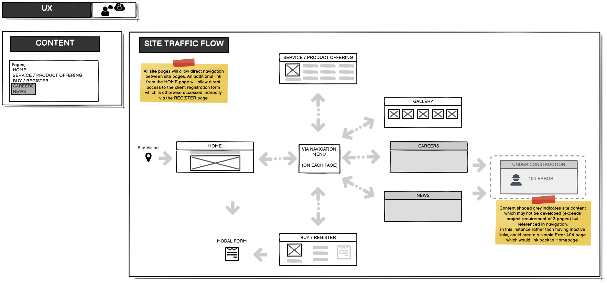
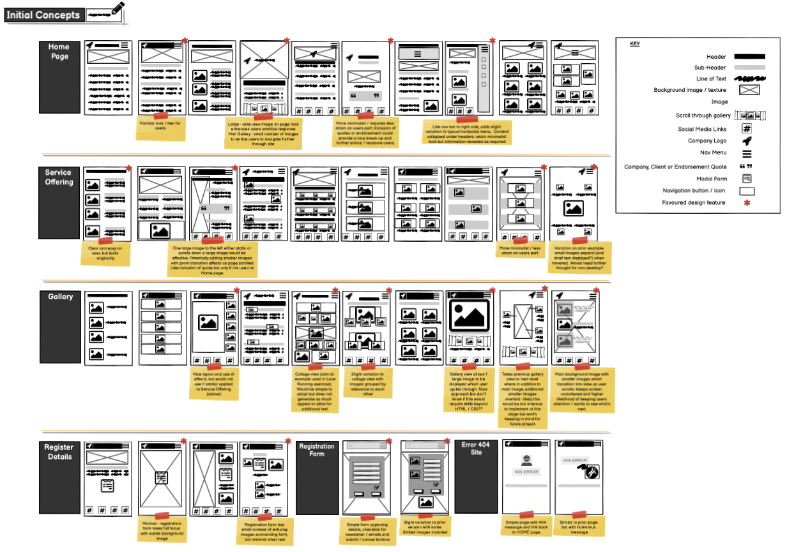
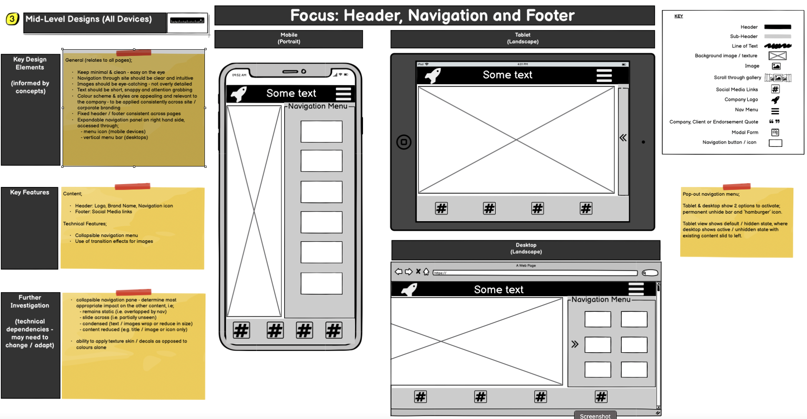
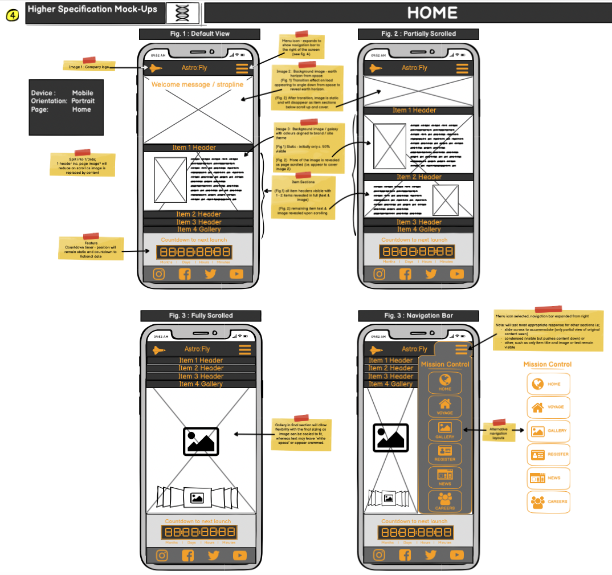
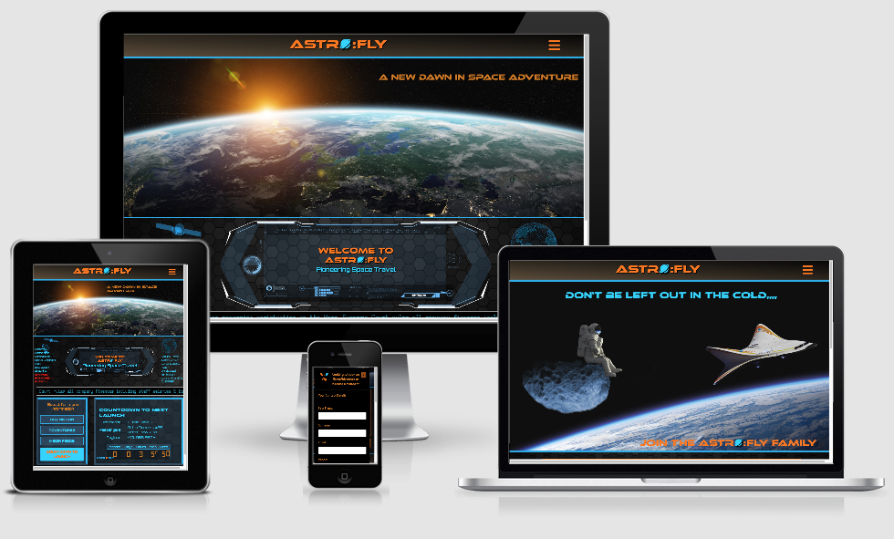

# Astro:Fly - Milestone Project 1

## Links to;

[Astro:Fly - Live Site](https://kelvenh.github.io/Astro-Fly_Milestone_1/index.html)

[GitHub Repo](https://github.com/KelvenH/Astro-Fly_Milestone_1/)

[Wireframes - v.Balsamiq](README-docs/Wireframe-Astrofly-Full-v.Balsamiq.bmpr)

[Wireframes - v.PDF](README-docs/Wireframe-Astrofly-Full.pdf)

***

## Contents

1. [Overview](#Overview)
2. [UX;](#UX)

   [- User Stories](#User-Stories)
   
   [- Personal Goals](#Personal-Goals)
   
   [- Scope](#Scope)
   
   [- Structure](#Structure)
   
   [- Skeleton](#Skeleton)
   
   [- Surface](#Surface)
   
3. [Content & Design Features](#Content & Design Features)
4. [Style](#Style)
5. [Technologies Used](#Technologies-Used)
6. [Testing](#Testing)
7. [Bugs, Defects & Key Challenges](#Bugs,-Defects-&-Key-Challenges)
8. [Deployment](#Deployment)
9. [Acknowledgements](#Acknowledgements)

---
## 1. Overview
Astro:Fly is a fictional company offering space tourism / commercial flights. In this scenario, the service has recently launched some routes with additional offerings to come and a web site is being launched to garner public interest, provide information and register details of potential clientele. This project has been undertaken for educational purposes to demonstrate HTML and CSS essential skills (Code Institute Milestone Project 1). Any referrences to technologies are purely fictional and are not based on scientific fact.  

---

## 2. UX

### User Stories 
#### Business Requirements (Fictional Scenario)
Astro:Fly require a site which;
- generates buzz and excitement to the general public and media
- conveys image of a safe and ethical brand (despite the slight irony the service could have on planet earth / airspace)
- provides prospective clients with summary of planned voyages tus leading to the registration of potential clientele

#### Client Goals (Fictional Scenario)
Site visitors are expected to fall into 1 of 3 categories;
- media; the new service is expected to create attention due to this being an extreme niche service / limited rivals
- general public; seeking latest information on the planned service such as timelines, what services will be offered and images 
- prospective clients, who are; 
      - able to find information about the services provided
      - clear and easy navigation through the site
      - easy registration of personal details for more information / booking.  

#### Personal Goals (Actual)
Through this project I am looking to; 
- Demonstrate understanding and application of HTML and CSS essential skills.
- Broaden personal awareness of further capabilities of HTML and CSS which go beyond those covered in module 1.
- Experience challenges, bugs, errors and frustrations through which problem solving will be a huge value-add / personal learn.
- Understand the limit of my current capabilities - looking to stretch myself without trying to achieve the impossible for a coding noob! 
- Serve as an example for a future portfolio of web site design and development which will also be used as an entry point which future projects can be assessed against to demonstrate improvements.
- The subject chosen for this project is to be fun, engaging but also on an area where broad range of dramatic / exaggerated design elements can be employed and have relevance - as opposed to a more traditional retail site where these would be out of place (e.g. use of transitional effects, fonts, color palette).
- Be proud of the final output!

### Scope - what's on the table for inclusion (or not)
  - landing / home page - welcome, intro and enticement to remain on site
  - detail of services - what, where, how?
  - gallery - images
  - client registration (modal form)
  
### Structure - how is information structured and logically grouped
  - consistent theme across sites
  - header / navigation menu and footer mirrored across all pages
  - central / main content to remain same theme / branding but adapted to suit requirements of that page and be interesting / exciting to the users.
  - content over minimu of 3 pages to include Home, Sales and Gallery

### Skeleton - how information will be presented / navigated
 - all pages must be responsive 
 - navigation will primarily be through the menu (to appear as drop down on small screen devices and potentially permanent sidebar for larger screens)
 - additional links added to act as shortcuts 
 - outine available in Balsamiq - example shown below
 
 
 
 

### Surface - what will the finished product look like; color palette, fonts, images and other design elements
  - initial outline developed in Balsamiq <link here> with example shown below
  - mock-up of final rendering (screen grabs)

---
## 3. Content & Design Features
Content & features initially considered and indication where incorporated into build or held-back as potential future developments and why.

Page | Features | In Build | Comments |
-----|----------|----------|----------|
General | Navigation menu and footer to social media links| Yes | 
Home | Intro, Countdown timer to next launch, news ticker | Yes | Majority of features included although some 'workarounds' e.g. countdown timer only counts down for a speciic time and resets on page load.
Flights|Oerview of the services provided with embedded images| Yes | Scaled back initial plans due to overall volume and some design elements which would have relied upon JS|
Sign-Up|Modal Form to register for details| Yes | in addiiton to sale enquiries page was also used to highlight and register for membership|
Gallery |animated scroll through of images|No - animation requires JS|Opted to embed images within Flights page|

---
## 4. Styles

### Site Theme

Considered | Selected| Notes|
-----------|---------|------|
Cyberpunk | No | Whilst preferred to style selected, expect this would require additional resources, time to incorporate which would detract from primary objectives for the project
Vintage (e.g. 70's prediction of future) | No | For same reasons as given above.
Futuristic | Yes | Expect these to be more easily available and achieved through basic shapes / easily available images |

### Color palette 

Opting for smart, sophisticated visual branding with futuristic styling. 

Extract of Balsamiq design elements;

---
## 5. Technologies Used
Bootstrap 4.5
Google Fonts
Font Awesome
Adobe Photoshop
Adobe Illustrator

---
## 6. Testing

---

## 7. Bugs, Defects & Key Challenges

---

## 8. Deployment

---

### 9. Acknowledgements
- slack community 
- Balsamiq introduction tutorials for wireframes
- getbootstrap.com
- csstricks.com
- codepen.io
- w3schools.com
- Github community
- YouTube (Kevin Powell and Dani Krossing) - 
- image sources - Adobe Stock, Shutterstock, Pexels and Depositphotos?

